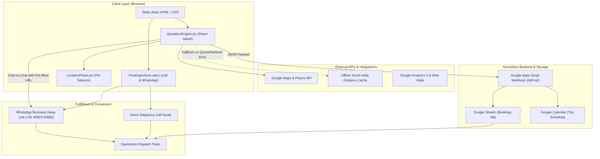

# System & Technical Architecture Document
## Project: Kalidass Travels
**Document Version:** 1.0.0  
**Status:** Approved / Active Baseline  
**Framework:** Astro 4.x + React 19 + Tailwind CSS 3.4 + Material Design 3  
**Hosting & CDN:** Netlify / Cloudflare Edge CDN  
**Backend:** Serverless Google Apps Script + Google Sheets DB + Google Calendar  

---

## 1. High-Level System Architecture

The Kalidass Travels web platform employs an **Islands Architecture** (powered by Astro). The majority of the site is pre-rendered static HTML/CSS to guarantee instantaneous first-paint speeds, 0.000 Cumulative Layout Shift (CLS), and 95+ SEO ratings. Highly dynamic interactive experiences (the Quotation Engine, Carousels, Location Pin Drop, and Modals) are isolated into lightweight React "islands" hydrated lazily on demand.



---

## 2. Technology Stack & Component Hierarchy

### 2.1 Core Stack
| Layer | Technology | Selection Rationale |
| :--- | :--- | :--- |
| **Static Site Generator** | **Astro 4.x** (`astro/config`) | Sub-second Time-To-First-Byte (TTFB), zero-JS by default, native markdown & JSON collection support. |
| **Interactive Islands** | **React 19** (`@astrojs/react`) | Rich state management for the multi-step quotation engine, dynamic vehicle pricing cards, and interactive modal dialogs. |
| **Styling & Design System**| **Tailwind CSS 3.4** + Google M3 | Material Design 3 design tokens directly integrated into `tailwind.config.mjs` for strict design coherence. |
| **Icons** | **Lucide React** & **Material Symbols Outlined** | Crisp, scalable vector icons mapped to M3 semantic roles. |
| **Performance Optimizations**| **`@playform/compress`**, **`@astrojs/partytown`** | Automatic Gzip/Brotli HTML/CSS/JS minification; web worker isolation for analytics to prevent main-thread blocking. |
| **Dynamic OpenGraph** | **Satori** + **Sharp** | Edge generation of high-resolution preview images for social sharing and WhatsApp card previews. |
| **Testing & Quality** | **Playwright** (`@playwright/test`) + **Axe-core** | Automated end-to-end booking flow verification and automated accessibility compliance testing. |

---

## 3. Data Flow & Booking Lifecycle

```
[User Selects Origin & Destination]
           │
           ├──► Attempt 1: Google Places & Distance Matrix API
           └──► Fallback: COMMON_DISTANCES_FROM_CHENNAI (Local JSON)
           │
[Calculate Fare by Vehicle Class]
           │
    Formula: Base KM Rate * Distance + Driver Bata + Night Duty
           │
[User Submits Booking / Requests Quote]
           ├──► 1. Trigger background async POST to Google Apps Script
           └──► 2. Generate WhatsApp Click-to-Chat deep-link
           │
[Google Apps Script Handler]
           ├──► Appends row to Google Sheet (Booking Timestamp, Name, Phone, Vehicle, Route, Fare)
           └──► Creates Google Calendar Event with trip details & 3-hour initial window
           │
[Operations Team Notification]
           └──► Dispatcher receives instant WhatsApp ping + Calendar alert for driver allocation
```

### 3.1 Fare Calculation Algorithms

#### A. Outstation One-Way Drop
$$\text{Chargeable KM} = \max(\text{Distance}, \text{Min Drop KM})$$
$$\text{Base Fare} = \text{Chargeable KM} \times \text{One Way Rate}$$
$$\text{Total Fare} = \text{Base Fare} + \text{Tolls/Interstate Permit (paid at actuals)}$$
*(Swift Dzire / Etios: Min Drop KM = 130 km @ ₹16/km; Tempo: Min Drop KM = 250 km @ ₹26/km)*

#### B. Outstation Round Trip
$$\text{Total Billable KM} = \max(2 \times \text{Distance}, \text{Days} \times \text{Min KM per Day})$$
$$\text{Base Fare} = \text{Total Billable KM} \times \text{Round Trip Rate}$$
$$\text{Driver Allowance} = \text{Days} \times \text{Driver Bata}$$
$$\text{Total Fare} = \text{Base Fare} + \text{Driver Allowance} + \text{Night Allowance (if between 10PM-5AM)}$$

#### C. Local City Hourly Packages
Standard packages: 4hr/40km, 5hr/50km, 8hr/80km, 10hr/100km, 12hr/120km.
$$\text{Extra KM Fee} = \max(0, \text{Actual KM} - \text{Package KM}) \times \text{Extra KM Rate}$$
$$\text{Extra Hr Fee} = \max(0, \text{Actual Hours} - \text{Package Hours}) \times \text{Extra Hr Rate}$$
$$\text{Total Local Fare} = \text{Package Rate} + \text{Extra KM Fee} + \text{Extra Hr Fee}$$

---

## 4. Google Apps Script Webhook Contract

**Endpoint Type:** Web App (`doPost`)  
**Data Transfer Format:** `text/plain` containing stringified JSON (bypasses browser CORS preflight restrictions).

### Payload Schema:
```json
{
  "date": "2026-09-20 19:30:00",
  "name": "Karthik Raja",
  "phone": "+919840012345",
  "tripType": "Round Trip",
  "pickup": "Medavakkam, Chennai",
  "drop": "Tirupati, Andhra Pradesh",
  "vehicle": "Toyota Innova Crysta",
  "passengers": 6,
  "distance": 135,
  "estimate": "₹7,200",
  "travelDate": "2026-09-25T05:00:00.000Z"
}
```

### Server-Side Execution (`google_apps_script.js`):
1. **Google Sheets Integration:** Appends record to the active operational bookings sheet.
2. **Google Calendar Event Creation:** Inserts a calendar event with 3-hour trip allocation block, formatted description, passenger contact, and pickup location for fleet managers.

---

## 5. Offline Fallback & Reliability Architecture

To protect against third-party API rate-limiting, Google Cloud billing exhaustion, or unstable mobile connectivity, the client incorporates a dedicated **South India Distance Lookup Matrix**:
- 40+ pre-calculated origin-destination distance nodes mapped from Chennai (`chennai-to-pondicherry: 151km`, `chennai-to-bangalore: 346km`, `chennai-to-tirupati: 135km`, etc.).
- When Google Maps Distance Matrix fails or throws `OVER_QUERY_LIMIT`, the system smoothly switches to the static dictionary without user disruption or UI freeze.

---

## 6. Performance & SEO Engine

1. **Static Pre-Rendering (SSG):** All service pages (`/services/chennai-airport-taxi/`, `/services/temple-tours/`, etc.) and tariff sheets (`/tariff/`) are pre-built to static HTML during `astro build`.
2. **Dynamic OG Image Pipeline:** OpenGraph social banners are automatically compiled from metadata using `satori` and `sharp`.
3. **Structured Data Hierarchy (JSON-LD):**
   - `@type: Organization` & `LocalBusiness` on root layouts.
   - `@type: TaxiService` with detailed pricing specifications.
   - `@type: FAQPage` dynamically populated on service and home pages.
   - `@type: BreadcrumbList` for streamlined search engine navigation.
4. **Sitemap Synchronization Hook:** `astro.config.mjs` executes an automated post-build hook syncing `sitemap-index.xml` to `sitemap.xml` for instant Google Search Console indexing.
